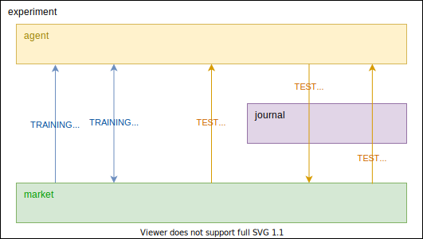

 [](https://codecov.io/gh/uoe-mlp/MLP-CW2-2021)

# Pythia
Times series deep learning model for trading.

## Main Classes
- ```experiment``` is the configurations of everything. In theory, this should be reproducible and deterministic (maybe I need to add a seed in the json). The experiment determines the temporal framework used. Values can be for instance walk-forward backtest, cross-validation, standard (=train-val-test), robustness analysis, transfer learning and so on
- ```market``` identifies the timeseries used and the logic used in calculating the trading costs
- ```agent``` is the trading agent. In the first case, ```agent``` is ```supervised``` and has two parameters: ```predictor``` and ```trader```. Otherwise, the agent is RL based.



# LaTeX Docs

Please find our LaTeX documentation [here](https://www.overleaf.com/read/qnywndwmwzqp)

# Execution

In order to run an experiment, run the following command in the terminal:

```
python pythia --run [SETTINGS_FILE]
```

For example:

```
python pythia --run data/experiments/chalvatzis/settings.json
```
